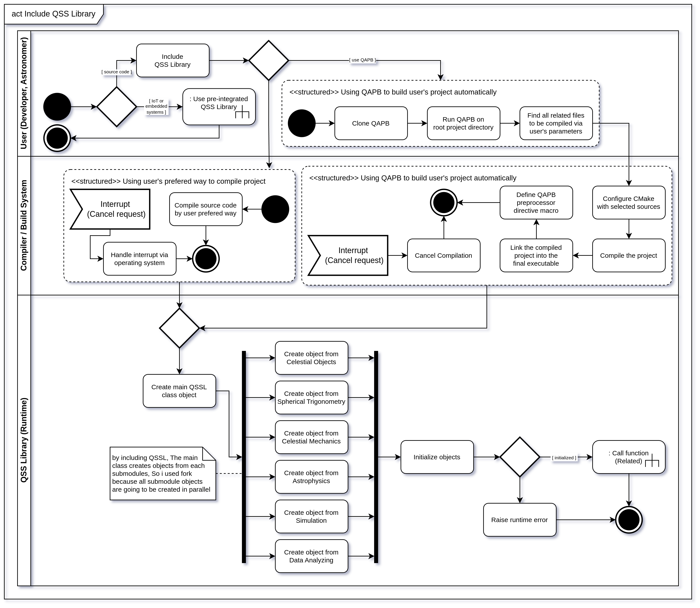
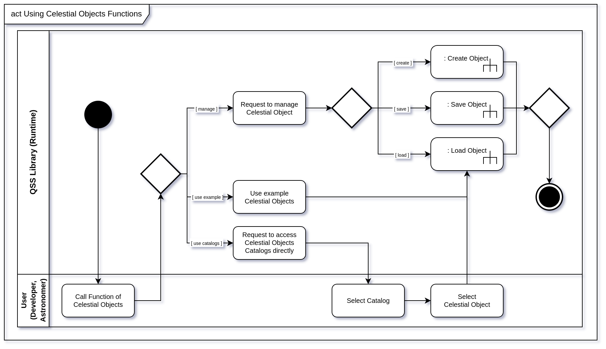
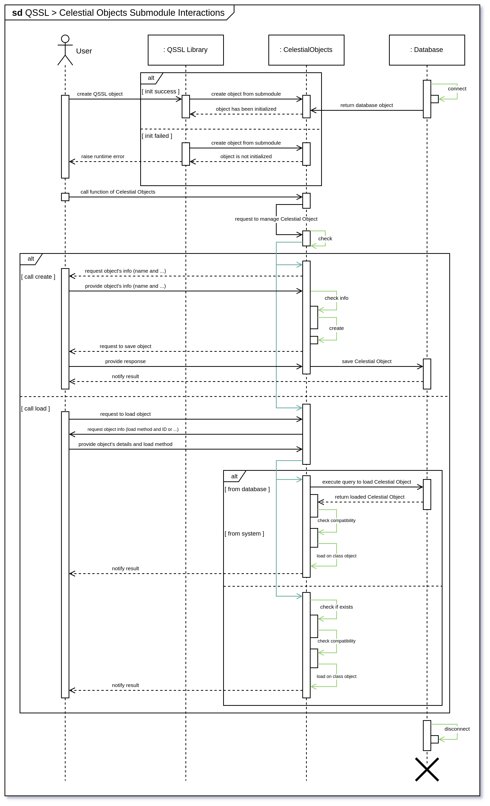
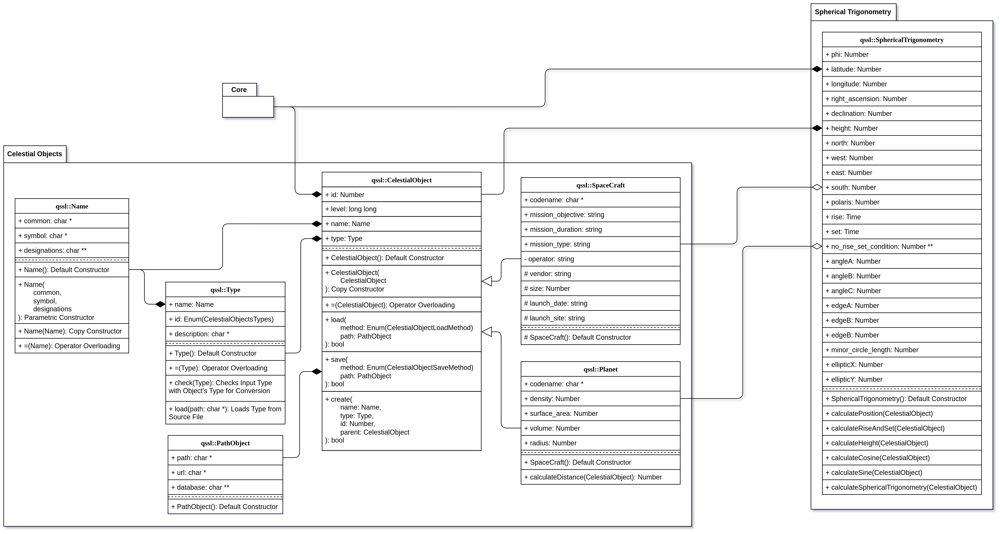
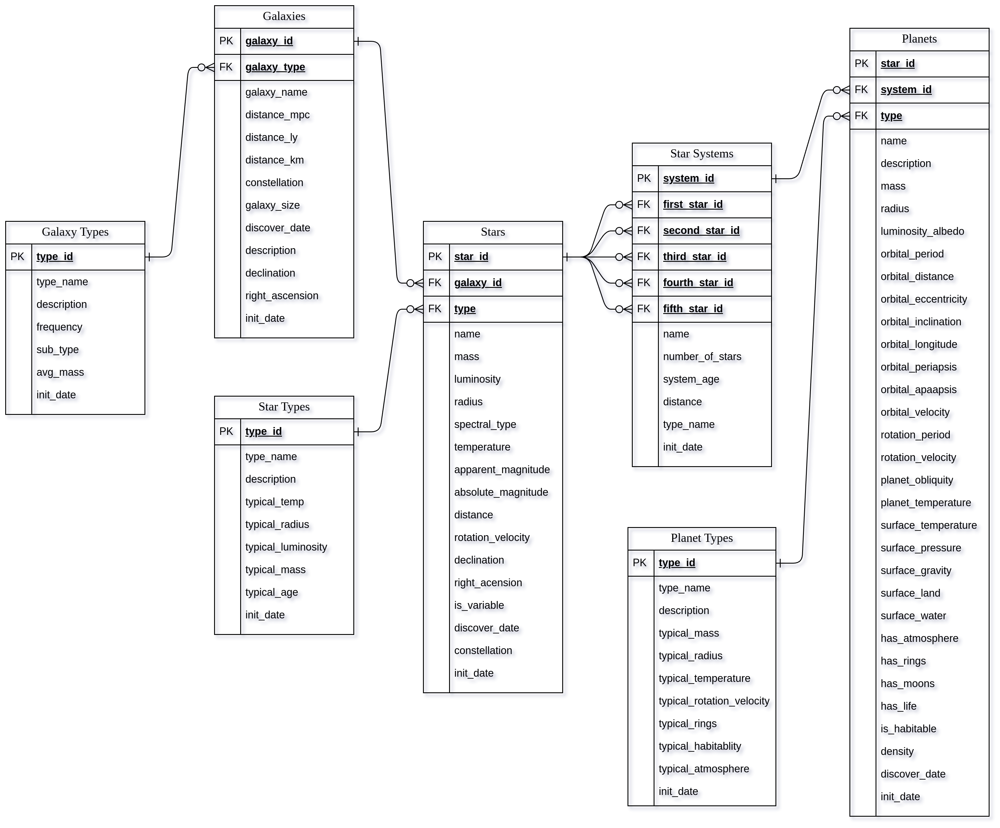

# Software-Engineering
Software Engineering Projects, Papers and Other Stuff

## Courses Info
- Term 6 : Analyse and Design of Systems
  - Teacher : Dr. Saman Shishechi
  - Score : 20 / 20
  - Semester : 6
- Term 7 : Software Engineering
  - Teacher : Dr. Hossein Mir Shojaei
  - Score : - / 20
  - Semester : 7

## Software Engineering Proposal
In a software engineering proposal, there are several items to consider :
1. Potential sub-systems
2. Challenges and limitations
3. Expectations and features
4. Skills and expertise
5. Methods and tools
6. Cost estimation
7. Time and scheduling estimation

There is a [PDF file](./Proposal.pdf) in root directory, It is the proposal of [QSS Library](github.com/QSSLibrary) containing all above items.

# Proposal Diagrams
## Usecase Diagram

  

## Activity Diagram

  

  

## Sequence Diagram

  

## Class Diagram

  

## Entity Relationship Diagram

  

